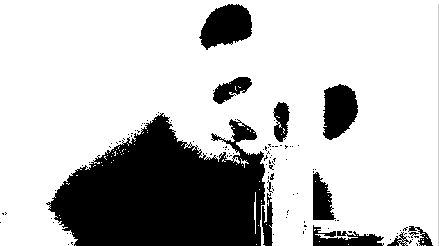
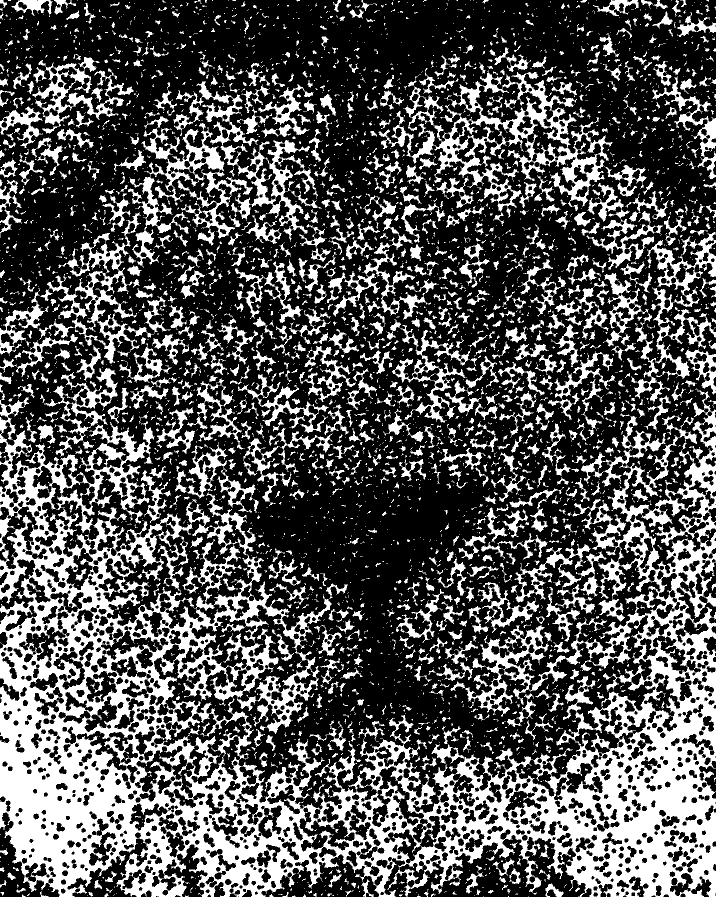
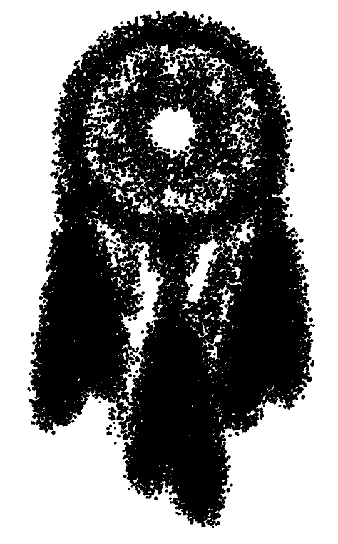

# BW Vector Particle Image Display

## Description
This project transforms a user-uploaded image into a visual representation using black-and-white particles.

Each pixel is represented by a particle of a single color, preserving the image's contrast and shading.

Clicking allows the user to switch between different graphics, offering a streamlined approach with captivating particle effects.

The project is easily adaptable for various types of data and graphical styles, making it versatile for creative and technical applications.

## Images
Here are some examples of the particle effects in action:

## Installation
To run this project, ensure you have the necessary environment set up. Download the project files and run `ProyectoFinal.pde` using Processing.

## Requirements
- Processing 3.0 or later

