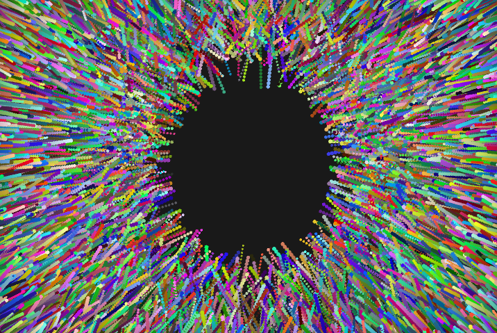
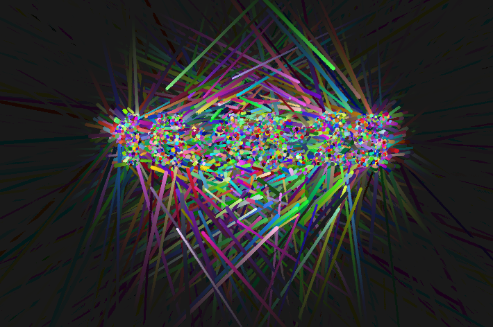
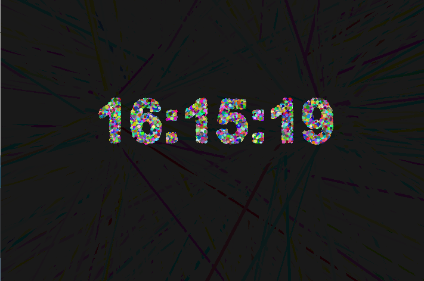
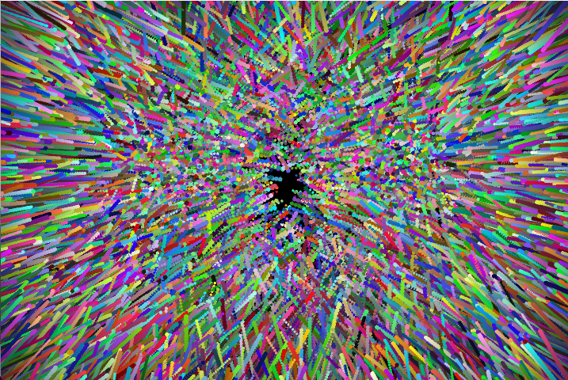
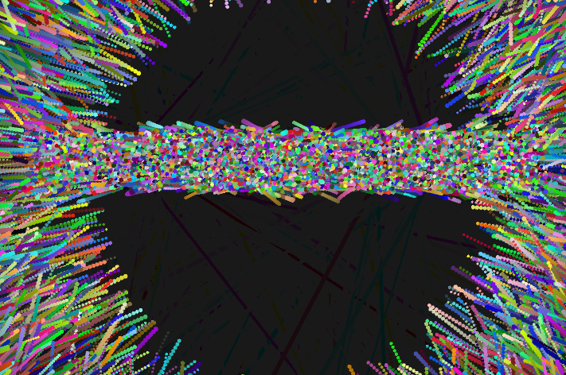
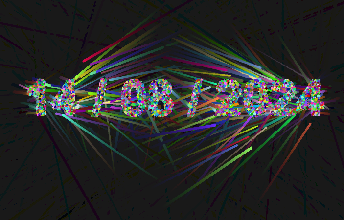
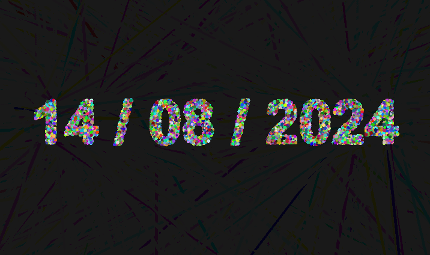
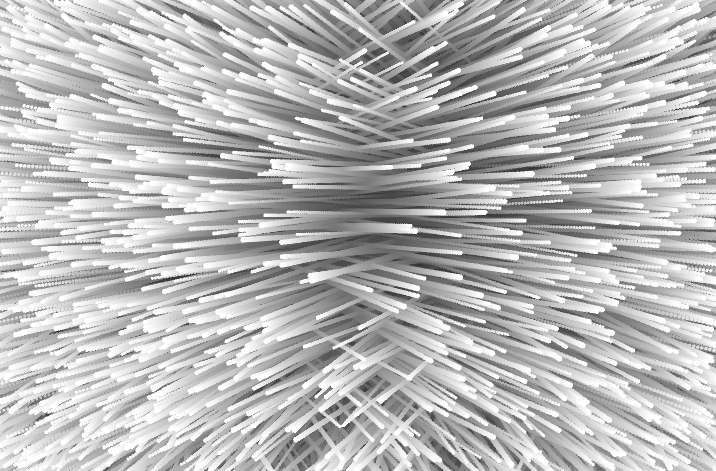

# Vector Particle Text Display

## Description
This project uses particles to display the current time and date.

Particles form the digits of a clock, with an engaging visual effect of particles flying around the screen.

Clicking changes the display to show the current time, date, or other text.

This project offers a visually captivating way to present real-time information with interesting particle effects and is easily adaptable for various types of data and graphical styles.

## Images
Here are some examples of the particle effects in action:

## Installation
To run this project, ensure you have the necessary environment set up. Download the project files and run `Proyecto3.pde` using Processing.

## Requirements
- Processing 3.0 or later

