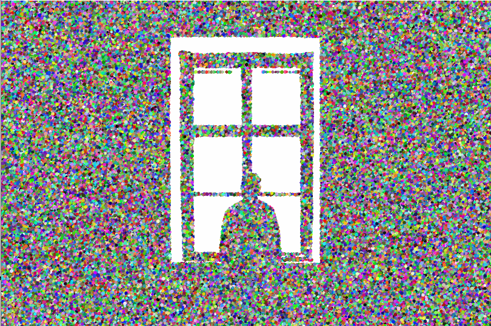
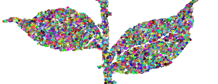
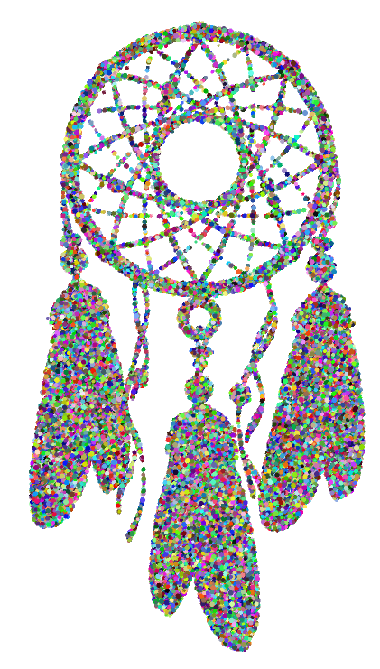
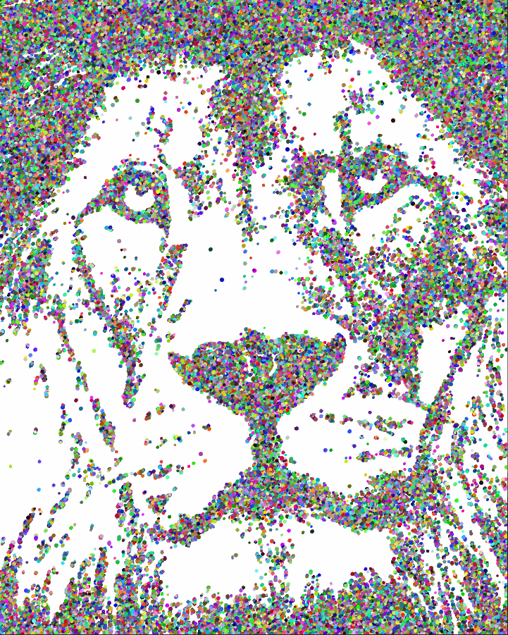

# Vector Particle Image Display

## Description
This project transforms a user-uploaded image into a visual representation using colored particles.

Each pixel of the image is mapped to a particle, recreating the image with a unique particle effect.

Clicking changes the display to various images, with particles dynamically adjusting to the new graphic.

The project is highly customizable and expandable for diverse visual applications.

## Images
Here are some examples of the particle effects in action:

## Installation
To run this project, ensure you have the necessary environment set up. Download the project files and run `ProyectoFinalCOLOR.pde` using Processing.

## Requirements
- Processing 3.0 or later

